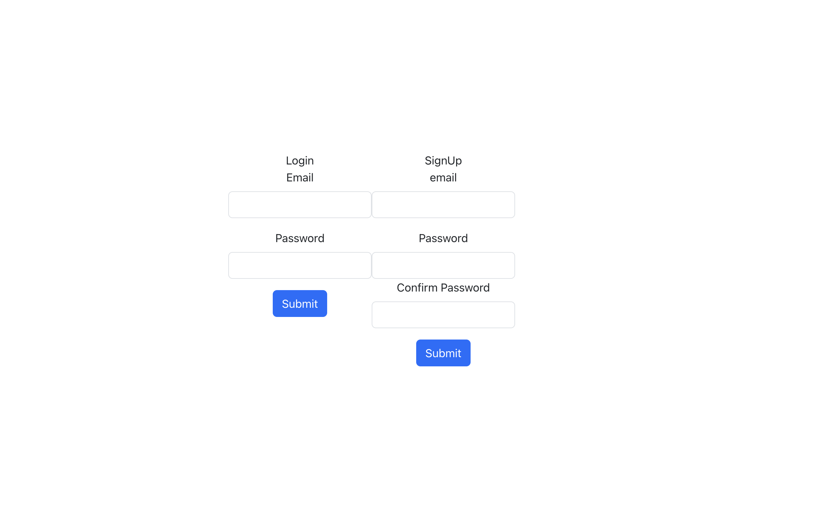

  # A basic start to a MERN project
  
  ## Description
  
  This basic code using the MERN technologies, JWT, and vite to start a new project. It has the back and front end needed for account creation and loggin in. I'm just using basic bootstrap to create what little front end there is

  you just need to include your own .env files with something like this in it: 
  
  ` SECRET=mern-basics`

  `EXPIRATION = 2h `

  
  ## Table of Contents
  
  - [Installation](#installation)
  - [Usage](#usage)
  - [Credits](#credits)
  - [License](#license)
  - [Contribute](#contribute)
  - [Tests](#tests)
  - [Questions](#questions)
  
  ## Installation

  ### The command that is needed to install the required dependenceies
  `
  npm i
  `

  ## Usage
  
  It's a starting point, saves on the tedious bits of starting a project
  
  ## Credits
  
  n/a
  
  ## License
  
  MIT license
## Notice

More information about the License being used
 [Link to the license](https://mit-license.org/)
  
  ## Badges
  
  
  
  ## Contribute
  
  n/a 
  
  ## Tests
  
  n/a  
  
  ## Questions
    
  If you have any questions, feel free to reach out to me at my [GitHub profile.](https://github.com/Nuclear Reid) or email me at 
  